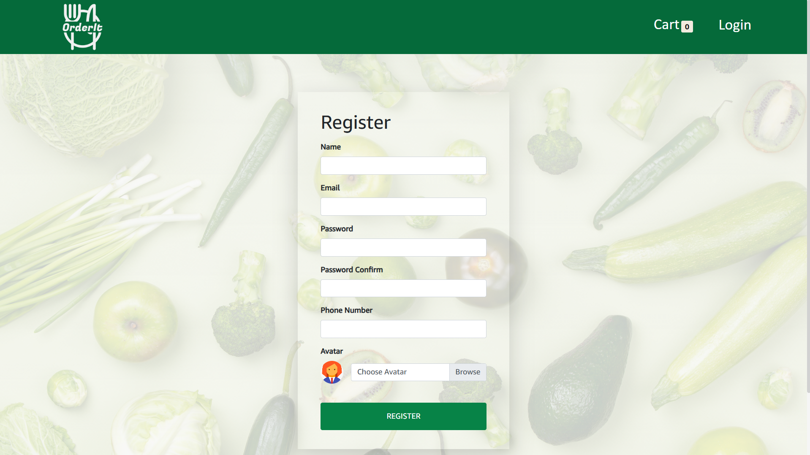
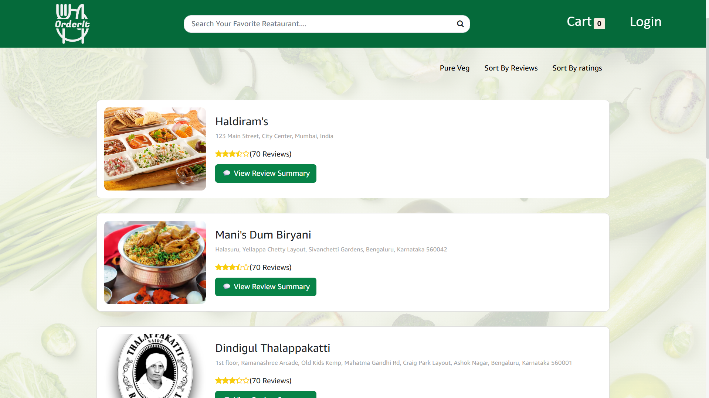
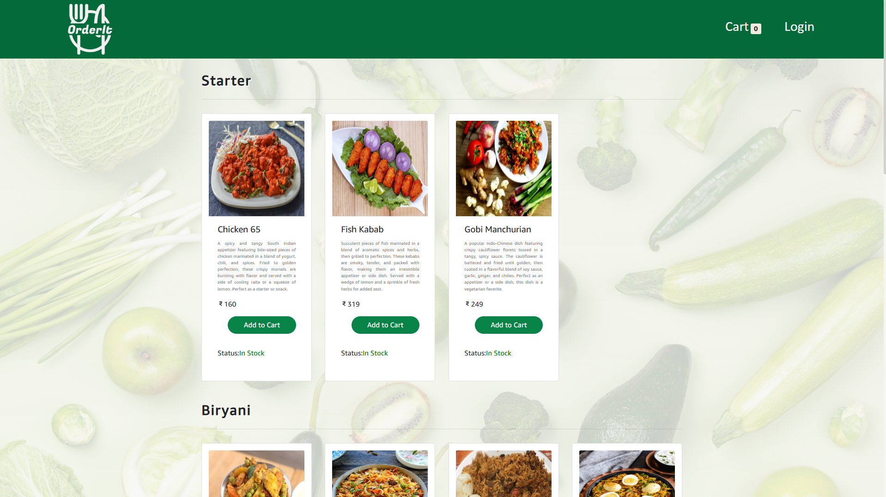
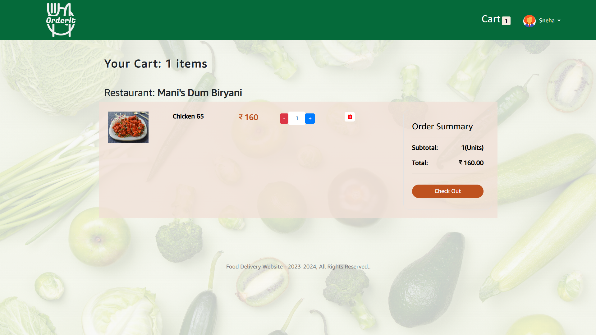
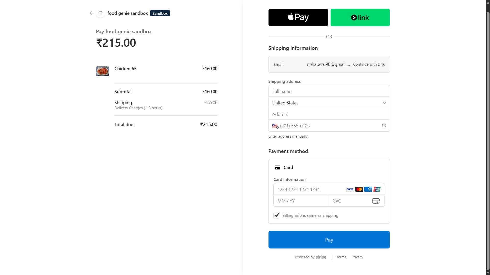
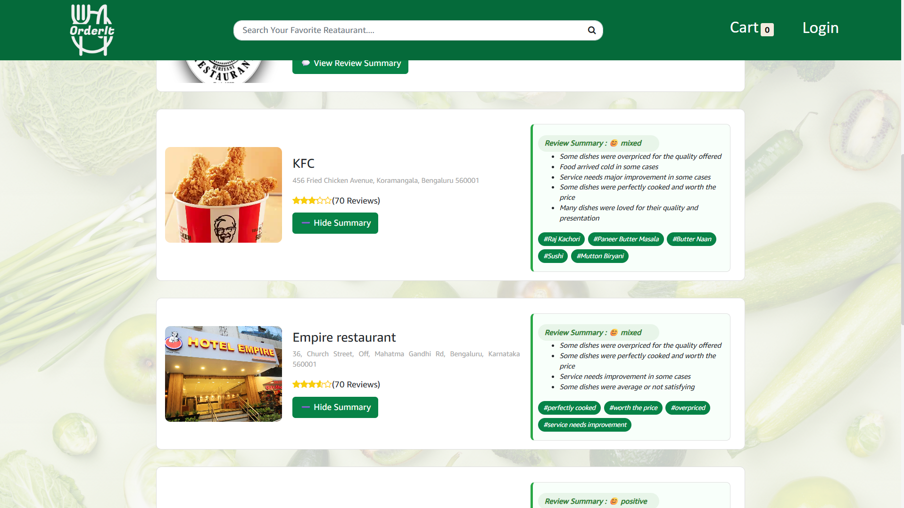

# OrderIt - AI-Powered Food Ordering Application

A full-stack food ordering web application built with the MERN stack, featuring AI capabilities, secure payments, and a seamless user experience. Originally designed for the Zyka restaurant, this p[...]

## 🚀 Features

### User Management
- **User Authentication**: Secure login and registration with JWT-based authentication
- **Profile Management**: Users can view, update, and manage their profiles
- **Email Verification**: Nodemailer integration for email notifications
- **Password Security**: BCrypt encryption for secure password storage

### Food Ordering
- **Store Discovery**: Browse and search restaurants with advanced search functionality
- **Menu Management**: View detailed menus with food items and descriptions
- **Shopping Cart**: Add/remove items from cart with real-time updates
- **Order Tracking**: View order history and detailed order information
- **Order Management**: Track current and past orders with status updates

### Payment Integration
- **Stripe Integration**: Secure payment processing with Stripe API
- **Multiple Payment Methods**: Support for various payment options
- **Payment Success Confirmation**: Automatic order confirmation after payment

### Admin Features
- **Data Seeding**: Populate database with initial data using seeder utility
- **Image Management**: Upload and manage product images via Cloudinary
- **Cloud Storage**: Secure image storage on Cloudinary CDN

### User Experience
- **Responsive Design**: Mobile-friendly interface with Bootstrap and React Bootstrap
- **Real-time Notifications**: Toast notifications with react-toastify and react-hot-toast
- **Modern UI Components**: FontAwesome icons and styled components
- **Data Tables**: Organized display of orders and data with react-data-table-component

## 📸 Screenshots

### Registration


### User Dashboard & Ordering


### Menu & Food Items


### Shopping Cart


### Checkout & Payment


### AI Review


## 🛠 Tech Stack

### Frontend
- **Framework**: React 18.3 with Vite build tool
- **State Management**: Redux Toolkit + React-Redux
- **UI Libraries**:
  - React Bootstrap 2.8
  - Styled Components 6.3
  - MDB React 5.2
- **HTTP Client**: Axios 1.14
- **Routing**: React Router DOM 7.13
- **Notifications**: 
  - React-Toastify 11.0
  - React-Hot-Toast 2.4
- **Icons**: FontAwesome 7.2
- **Additional**: React Modal, react-data-table-component
- **Build Tool**: Vite 8.0

### Backend
- **Runtime**: Node.js with Express.js 4.18
- **Database**: MongoDB with Mongoose 7.2
- **Authentication**: JWT (JSON Web Tokens) + Bcrypt
- **Payment Processing**: Stripe 12.14
- **File Upload**: Multer + Multer-Storage-Cloudinary
- **Cloud Storage**: Cloudinary for image management
- **Email Service**: Nodemailer 6.9
- **Validation**: Validator.js 13.9
- **CORS Support**: CORS middleware for cross-origin requests
- **Development**: Nodemon for auto-reload

### Other Services
- **Cloudinary**: Cloud-based image storage and management
- **Stripe**: Payment processing
- **MongoDB**: NoSQL database

## 📁 Project Structure

```
OrderIt-AI-Application/
├── frontend/                 # React frontend application
│   ├── src/
│   │   ├── components/      # Reusable React components
│   │   ├── redux/           # Redux store, actions, and reducers
│   │   ├── App.jsx          # Main App component
│   │   └── App.css
│   ├── package.json
│   └── vite.config.js
├── backend/                  # Express.js backend
│   ├── config/              # Configuration files (database, config.env)
│   ├── utils/               # Utility functions (seeder, email handlers)
│   ├── server.js            # Entry point
│   ├── app.js               # Express app setup
│   ├── package.json
│   └── node_modules/
├── screenshots/             # Application screenshots
└── README.md
```

## 🔧 Installation & Setup

### Prerequisites
- Node.js (v14 or higher)
- MongoDB (local or cloud instance)
- Cloudinary account
- Stripe account

### Environment Variables

Create a `backend/config/config.env` file:

```env
PORT=4000
NODE_ENV=DEVELOPMENT

# MongoDB
MONGO_URI=your_mongodb_connection_string

# JWT
JWT_SECRET=your_jwt_secret
JWT_EXPIRE=7d

# Cloudinary
CLOUDINARY_CLOUD_NAME=your_cloudinary_name
CLOUDINARY_API_KEY=your_cloudinary_api_key
CLOUDINARY_API_SECRET=your_cloudinary_api_secret

# Stripe
STRIPE_SECRET_KEY=your_stripe_secret_key
STRIPE_API_KEY=your_stripe_api_key

# Email (Nodemailer)
EMAIL_SERVICE=your_email_service
EMAIL_USER=your_email@gmail.com
EMAIL_PASS=your_email_password
```

### Backend Setup

```bash
cd backend
npm install
npm run start          # Development with nodemon
npm run dev            # Alternative development mode
npm run seeder         # Populate database with sample data
```

### Frontend Setup

```bash
cd frontend
npm install
npm run dev            # Start Vite development server
npm run build          # Build for production
```

## 📖 Usage

1. **Start the backend** on `http://localhost:4000`
2. **Start the frontend** on `http://localhost:5173` (or your configured Vite port)
3. **Register/Login** with your email
4. **Browse restaurants** and menus
5. **Add items** to cart
6. **Proceed to checkout** with Stripe payment
7. **View order history** in your profile

## 🔐 Security Features

- JWT-based authentication
- BCrypt password hashing
- Secure Stripe payment integration
- Environment variable configuration
- Error handling for uncaught exceptions
- Input validation with Validator.js
- CORS protection

## 📊 Code Composition

- JavaScript: 87.8%
- CSS: 11%
- Other: 1.2%

## 🚀 Future Enhancements

- AI-powered food recommendations
- Advanced order scheduling
- Push notifications
- Admin dashboard
- Analytics and reporting
- Restaurant partner system

## 👨‍💻 Acknowledgments

Built with the guidance and support of **WebStack Academy's Internship Program**.

---

**OrderIt** - Making food ordering simple and delicious! 🍕
